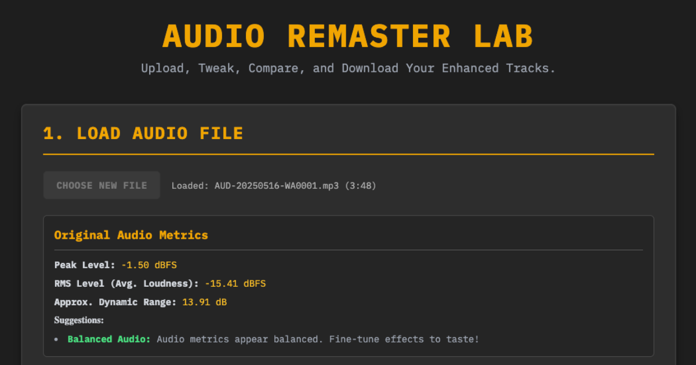

# 🎧 Audio Remastering Lab

A browser-based tool for enhancing audio tracks with professional-grade effects.

  

## 🚀 Overview
Drag sound files in to window and remaster them in seconds - then download to desktop .
This is superfast - most online apps require you to subscribe so i created this to do the same thing from any desk top.
Works on any windows desktop - lightning fast audio remix - in html

## ✨ Features

- Parametric equalizer with bass, mid, and treble controls
- Dynamics processing with compressor and limiter
- Stereo enhancement and reverb effects
- Analog-style warmth/saturation
- Real-time A/B comparison between original and remastered audio
- Audio metrics analysis
- One-click download of processed audio

## 🔒 Privacy

**All processing is done entirely client-side in your browser.** 

Your audio files are never uploaded to any servers, ensuring complete privacy and data security.
You can verify this by examining the source code in this repository.

